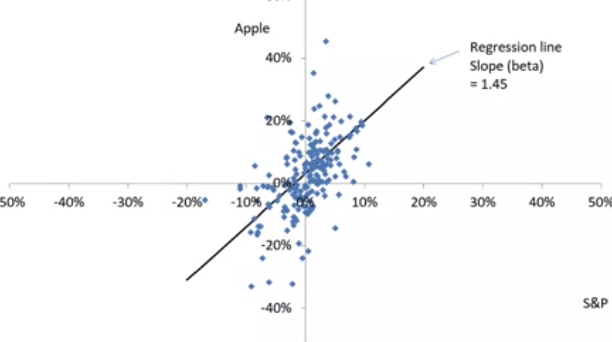
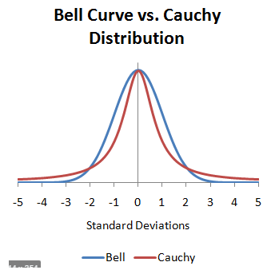
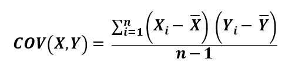
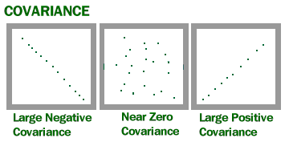
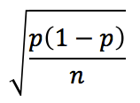
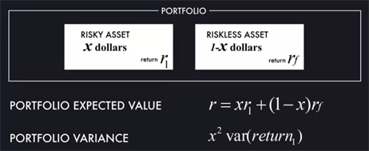
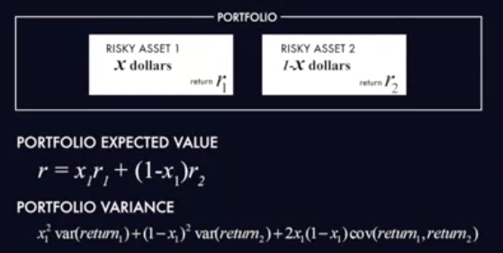
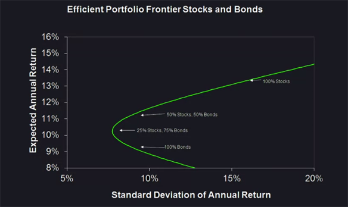

# Leçon 1

La finance n'est pas seulement faire de l'argent mais faire en sorte que les gens créatifs puissent créer. Le marché a besoin d'être régulé car la tendande des hommes c'est de le manipuler. Bon soit disant, les gros business men finissent philantropistes ... OK, on s'en fout. D'après lui, les Financial markets sont essentiels au succès économique d'un pays

# Leçon 2

### VaR et Stress Tests

 * VaR : Value at Risk. Défini en 1987, mesure le risque d'un portfolio
   * 1% 1 year VaR of 10 millions signifie que le portfolio a une probabilité de 1% de perdre 10 millions
 * VAR : Variance. Mesure la variabilité d'un portfolio
 * Stress Test (test d'efforts) : ensemble de mesures conduites pour évaluer la robustesse d'une entreprise face à une hypothétique crise financière. Alors apparemment, les insitutions financières américaines sont soumis à des stress tests tout les ans par une instance appelée la OFHEO. Le stress test repose sur trois scénarios différents (par exemple : le dollar qui baisse, plus de liquidité, etc.). Le stress test a une valeur évidente pour le patron d'une entreprise mais celui-ci n'a aucun intérêt à rendre ce genre de résultat publique si celui-ci lui est défavorable. Raison en partie pour laquelle certaines doutent de la pertinence des résultats des stress tests opérés jusqu'ici car ils sont globalement toujours positifs. Les raisons seraient que :
   * Les responsables des tests seraient incompétents
   * Les entreprises financières feraient une sorte de rétention d'informations aux instances responsables, de sorte qu'il serait difficile d'évaluer correctement les choses

### S&P 500

Le [S&P 500](https://fr.wikipedia.org/wiki/S%26P_500) est un indice boursier de 500 grandes entreprises américaines. Il est *détenu* par [Standars And Poor's](https://fr.wikipedia.org/wiki/Standard_%26_Poor%27s). C'est une société qui publie des analyses financières, i.e. qui donne des bons ou des mauvais points aux grandes entreprises. Le S&P 500 subit beaucoup de fluctuations ce qui fait dire au profs que les actions des boîtes dépendent les uns des autres, car s'ils étaient indépendants, le cours du S&P 500 serait moins volatile. (Comprend pas pourquoi??)

### Beta

Si je comprends bien le S&P 500 est une mesure de la santé du marché (global). En traçant les monthly return de Apple versus S&P 500, on peut s'apercevoir de deux choses : 
 1. Il existe une corrélation. Quand le marché monte, Apple monte.
 2. Cette corrélation est à l'avantage de Apple. Quand le marché monte, Apple monte encore plus (1.45>1)
 3. Le **beta** d'une action est la valeur de cette corrélation
 4. L'or est connu pour avoir un beta négatif. Quand l'économie se porte bien, tt le monde se fout d'en avoir mais en cas de crise, c'est une valeur qui s'arrache
 5. Apparemment un beta élevé signifie un risque élevé mais également un plus grand rendement

### Le risque d'une action

Le risque d'une action = **risque du marché** + **risque idiosyncratic**
 * risque du marché = Beta² * Variance(market return). Je suis pas sûr de la formule. Market risk is the risk for an asset to experience losses due to factors that affect the entire stock market
 * risque idiosyncratic = Variance(résidus). Idiosyncratic risk is the risk which is endemic to a specific asset and therefore not the market as a whole

### Régression linéaire dans la finance

 * Y = mx + b (trouvé m et b tel que Yi-(mxi+b)² soit minimum)
 * Y : Stock Monthly Return
 * m : Beta
 * x : Market Return
 * b : Alpha 

### Distribution de Cauchy

En finance, les objets qu'on manipule ont tendance à suivre des lois de Cauchy plutot que des lois normales. Quelques rappels :

 * Theoreme central limite : la moyenne de x variables aléatoires et indépendantes suit une loi normale. Ceci n'est pas vrai si les lois de distributions possèdent des fat tails.
 * Loi de cauchy : pareil que la loi normale mais possède des fat tails. Les événements extraordinaires sont en quelque sorte beaucoup plus probables

### Risque et covariance

#### **Idée sous jacente**

**C'est LE point le plus important du cours jusqu'ici**. Admettons qu'on souhaite miser sur deux actions. Si la covariance des deux titres est nulle alors ça signifie que les probabilités de *réussite* des deux titres sont indépendantes l'une de l'autre. Si la covariance est positive, cela signifie que leur probabiliité de réussite sont corrélés positivement, autrement dit si l'une réussit, l'autre également mais si l'une se crash alors l'autre aussi. Lors de la construction d'un portfolio, on veut s'assurer que la covariance n'est PAS positive car c'est trop risqué. **LE RISQUE EST DETERMINE PAR LA COVARIANCE**. Dans le cas où ma covariance est négative, cela peut également nous intéressé car cela signifie que l'un des deux titres explosera quand l'autre se crashera, ce qui peut être à notre avantage s'il explose pour de bons. Les grands investisseurs sont donc ceux qui arrivent à estimer cette covariance de manière correcte ce qui fait appel à une forme d'intuition ou d'intelligence

#### **Rappel mathématique**

#### **Beta et covariance**

Le Beta vu plus haut, est la covariance entre le titre et le marché normalisée entre 0 et 1. Le Beta d'une entreprise vaut en moyenne 1 car la variance du titre sera en moyenne égale à celle du marché, la covariance d'une variable avec elle même étant égale à la variance, le Beta moyen vaut 1

# Leçon 3

### Assurance

Si chaque n personnes souscrivent à une assurance bris de glace. Si la probabilité qu'ils cassent leur pare brise dans l'année est égal à p et que ces événements sont indépendants (i.e. pas de guerre, pas de tempêtes) alors le nombre de pare brise cassés à la fin de l'année est une variable aléatoire X qui suit une loi binomiale de paramètres (n,p). Autrement dit, le nombre de pare prises cassés à la fin de l'année sera en moyenne de np et la standard deviation (aka la variance, aka le risque) sera de : 

Autrement dit, plus le nombre de personnes ayant souscrit à cette assurance est élevé, plus on peut estimer avec certitude le nombre de pare brises cassés. Quand n tend vers l'infini, la standard deviation tend vers zéro.

### Pitfalls de l'assureur - selection bias

L'assureur doit être capable de correctement estimer le *p*. L'erreur la plus commune est le selection bias. Disons que l'assureur sait que 1% des voitures voient leur pare brises cassés en France au cours d'un an. Il est alors tenté d'affirmer que p vaut 0.01. Seulement, il s'avère que ce sont les personnes habitant les quartiers les plus criminogènes qui souscrivent à une assurance bris de glace. Or, dans ces quartiers le nombre de pare brises cassés au cours d'un an n'est pas de 1% mais de 10%. 

### Quand l'assureur est assuré

 * Afin que les assureurs aient toujours de quoi couvrir les assurés, ils sont soumis à une espèce de régulation. C'est relativement récent dans l'histoire, dans le connecticut jusqu'en 1972, si votre assureur faisait faillite vous étiez foutus. Aujourd'hui les états et les gouvernements prennent le plus souvent les choses en charge. Le fameux *too big to fail* signifie que l'état ne peut pas se permettre de laisser telle entreprise faire faillite à cause des nombreuses interconnections qu'elle a dans l'économie du pays. Ce qui amène au problème suivant : comment s'assurer que les entreprises, sachant qu'elles sont backées par l'état, fassent les efforts de trésorerie et de liquidité suffisants. Certaines en abusent.
 * Les assureurs sont également assurés en cas de catastrophes imprévisibles

### Obamacare et le problèmes des assurances santé

Les assurances santé souffrent du problème suivant aux USA : seuls les gens qui se savent malades envisagent de souscrire. Or sachant qu'ils sont malades, les assureurs pratiquent des tarifs exorbitants. Les tarifs étant exorbitants, les gens en bonne santé refusent d'y souscrire. L'Obama care a tenté de résoudre le problème de la manière suivante : en forçant les gens malades ou pas à souscrire à une assurance santé. La sanction étant une forte amende. Ainsi, les tarifs peuvent baisser et l'ensemble de la population peut être assurée.

### Catastrophes naturelles et terrorisme

Le gouvernement américain pousse les habitants à prendre des assurancs dans les zones à risque en insistant sur le fait qu'ils ne les aideront pas plus que ça (à part des prêts plus avantageux). Concernant le terrorisme, peu d'assureurs sont prêts à protéger contre le terrorisme tant de nombreux événements peuvent être corréles les uns aux autres. Si un 11 septembre arrive une seconde fois, des milliards de dollars de réparations pour des milliers de personnes seraient nécessaires alors qu'il ne s'agit que d'un seul attentat. Dans ce cas, le gouvernement accepte de jouer le rôle de l'assureur et protège la population contre ce risque en mettant la main à la poche.

# Leçon 4

### Diversification de portfolio, le principe

Admettons qu'on soit un super ingénieur financier, et qu'on a raison 90% du temps sur la *réussite* d'une action ou pas. Au bout d'un nombre relativement faible d'essais, on se trompera nécessairement, ce qui signifie que si l'argent investi est grand alors le risque de ruine est non négligeable. Un bon ingénieur financier veut construire un portfolio qui pour un retour moyen donné a un risque minimum. C'est le CAPM, un modèle mathématique qui permet de construire le portfolio optimum

### Cygne noir

Théorie développé par le statisticien et trader Nassim Taleb selon laquelle les stratégies d'investissements ne prennent jamais en compte les événements rares alors que ces événements bien qu'êxtremement peu probable, ont un impact gigantesque

### Equity premium puzzle

Apparemment, on observe que le rendement des actions risqués serait supérieur à celui des obligations moins risqués. Ce qui serait surprenant selon les experts. **MOI PAS COMPRENDRE LE PROBLEM**.

### CAPM

Alors c'est un modèle qui affirme que sous certaines hypothèses (très) contraignantes, le rendement moyen d'une action est lié à son beta, au rendement moyen du marché et au risk free rate (taux sans risque) de cette manière :
 * R(action) = RFR + Beta(R(Marché) - RFR)
 * voir la [vidéo](https://www.youtube.com/watch?v=fDz_DgDJD5g&ab_channel=Edspira)
 * Selon le modèle, on ne peut pas avoir de stratégie *short sales*, car si c'est une stratégie collective alors tt le monde short sell, et donc plus personne ne détient l'action, bon j'ai pas trop capté

### Short sales

La plupart des brokers permettent de détenir une somme négative d'actions. C'est ce qu'on appelle le short selling. Ce serait un élément important d'un portfolio correctement diversifié si je comprends bien. Le principe est le suivant : j'estime qu'une action A est surestimée. Son prix est de 100 €. Je prétends que je la détiens et je la vends à Jean-Louis. Je récupère donc 100 €. Seulement, Jean-Louis n'a toujours pas reçu l'action. Le broker me permet de donner l'action à Jean-Louis un peu plus tard. Or, l'action étant surestimée, le marché se réajuste et l'action ne vaut plus que 90€. J'achète donc l'action à ce moment là, la donne à Jean-Louis et je gagne donc 100 - 90 = 10 € dans l'opération.

### Optimal portfolio

Exemple d'un portfolio avec deux actions, une risquée et une autre sans aucun risque. En shortant le riskless asset, on peut obtenir un portfolio avec un rendement illimitée. Seulement, ce sera au prix d'une grosse variance et donc d'un risque de ruine proche de 1

Exemple d'un portfolio avec deux actions risquée. Comme on peut le voir, lorsque la covariance entre les deux actions est positive, ca augmente la variance du portfolio et donc ca multiplie le risque de ruine. On cherche la covariance la plus petite possible, voire négative

### Optimal portfolio frontier

Le graphique ci-dessous représente pour chaque rendement, la diversification de portfolio qui donne la variance minimum :

# Questions et vocabulaire

 * **Mortgage** : apparemment ce serait une sorte de prêt de la banque si tu leur accord le droit de saisir la propriété que tu tentes d'acheter avec le prêt
 * **Second mortgage** : ce serait un autre prêt auquel on aurait le droit sous certaines conditions
 * **Monthly Stock Return** : ce serait la croissance mensuel d'un investissement. Apparemment, ce serait une mesure qui souffrirait d'une grande variabilité. Très difficile d'estimer la santé financière de deux companies en comparant uniquement leurs courbes de monthly stock return
 * **Equity premium puzzle** : pas tt compris
 * **Short sales** : ceux qui achètent à des types qui short sell sont-ils au courant? Comment font-ils s'ils veulent revendre l'action avant qu'elles leur soit parvenu?

# Anglais

 * to be thrilled to be : être excité/avoir l'honneur
 * chalk talk : lit. discous à la craie, en gros un cours avec la possibilité de faire des illustrations
 * self indulgent : qui ne fait que jouir

